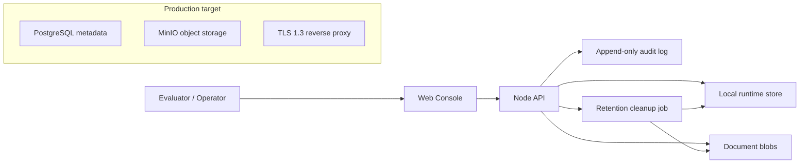
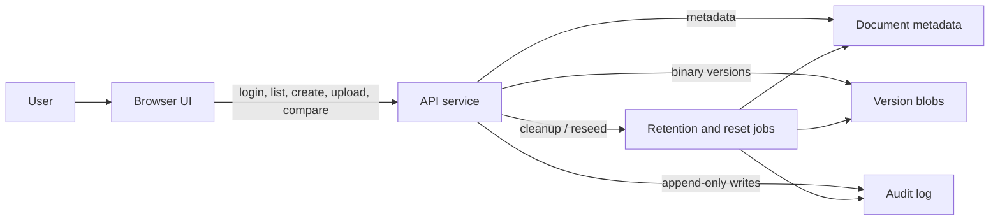

# Enterprise Document Management System

## 1. Problem Statement

Enterprise release work depends on documents that are easy to trace, easy to govern, and hard to tamper with. The requested system must standardize project documentation, preserve history, support document comparison, enforce hierarchical access control, and produce an audit trail that survives governance review.

The design target is a production-oriented document management system that can support project documentation throughout the release lifecycle, while also remaining simple enough to demonstrate in a compact, reviewable deployment.

## 2. Requirements Analysis

The brief decomposes into six core concerns:

1. Document storage and version management.
2. ABAC authorization with department and project inheritance.
3. Security controls for transit, storage, and auditability.
4. Diff support for text, PDF, and Word documents.
5. Containerized deployment.
6. A clear demo workflow for evaluation.

Key constraints shape the implementation:

- Maximum file size: 5 MB.
- Retention cannot be hard-coded.
- Audit events must be append-only and traceable.
- PDF diffs must compare extracted text.
- Word diffs must compare underlying XML structure.
- Project role overrides department role; if project role is missing, department role is inherited.

## 3. Architecture

The repository is organized as a monorepo with a small API service and a browser-based demo UI.

### System at a glance

The demo implementation in this repository uses a file-backed runtime store so the solution stays self-contained in the workspace. The target deployment design still maps cleanly to PostgreSQL metadata and MinIO object storage, which are included in the deployment package and documented as the production path.

### Request flow

1. The user signs in with a seeded demo account.
2. The UI calls the API to list visible documents, audit events, and retention settings.
3. The API evaluates access using user, document, and project attributes.
4. Versions are written as immutable blobs with metadata records.
5. Audit events are appended as newline-delimited JSON.
6. Diff requests compare selected versions and return highlighted changes.

### Reset path

For demo recovery, the system can reset all seeded state and audit history in one step. The reset flow recreates the runtime store, clears the append-only audit file, and rebuilds the default sample documents and users.

### Document Management Workflow

The standard operational workflow in the application follows these steps:
1. **Create Document**: An Editor or Admin creates a new document by providing initial content and classification. A new version is created automatically.
2. **Version Control (Upload)**: Authors (Editors/Admins) update the document by uploading a new version. The system handles this immutably, preserving the original versions.
3. **Compare / Diff**: Users can view changes between any two versions using the built-in diff tool (supports Text, PDF, and Word documents).
4. **Audit Review**: Every view, download, creation, and edit generates an append-only audit event. Admins can review these trails for governance.
5. **Archiving & Retention**: Once a project is archived, its documents become read-only. A background cleanup job enforces retention policies by deleting obsolete versions.

## 4. Technology Choices

### API

The implementation uses Node.js with a minimal HTTP server for the demo runtime.

Justification:

- No dependency installation is required to run the demo in this workspace.
- The code remains easy to inspect and containerize.
- The server shape maps directly to a NestJS-style service decomposition if the project later migrates to a richer framework.

### UI

The browser console is implemented as a single-page application with vanilla JavaScript and CSS.

Justification:

- Keeps the demo runnable without a frontend build chain.
- Still supports the full workflow: login, list, create, upload, compare, and audit.
- The UI is intentionally operational rather than marketing-oriented.

### Storage
The runtime store is file-backed for the demo, with a schema and deployment package designed around PostgreSQL and MinIO.

Justification:

- Local filesystem persistence is enough to demonstrate versioning and audit behavior.
- The production target keeps the design aligned with enterprise expectations: relational metadata, object storage for binaries, and clean separation of concerns.

### Deployment

Docker Compose is used for the demo and infrastructure package.

Justification:

- It is easy to review.
- It supports the requested containerized deployment model.
- It keeps the demo accessible without requiring a Kubernetes cluster.

## 5. Data Model

The design separates metadata, versions, roles, settings, and audit records.

### Core entities

- `users`
- `departments`
- `projects`
- `department_roles`
- `project_roles`
- `documents`
- `document_versions`
- `system_settings`
- `audit_events`

### Metadata behavior

- A document stores ownership, classification, project association, and latest version pointers.
- Each document version stores file name, MIME type, checksum, size, version number, creator, and timestamps.
- Audit records are immutable and append-only.
- Retention policy is stored in configuration, not hard-coded in code paths.

### Suggested relational shape

The production schema can be mapped directly to PostgreSQL tables with foreign keys on user, project, and document references. The demo implementation mirrors the same logical entities even though it uses a file-backed store.

## 6. Storage and Versioning Design

Versioning is implemented as immutable version records.

Behavior:

- Creating a document writes the initial version immediately.
- Uploading a new version creates a new immutable record.
- Historical versions remain addressable by version ID.
- The latest version pointer is updated on the document record.

Retention:

- The retention duration is stored in settings.
- Cleanup is performed by an external job or scheduled task.
- The demo includes a cleanup script that can be called manually or on a schedule.
- The cleanup flow removes old non-latest versions while preserving current records.

Blob handling:

- Stored document bytes are written to runtime blob paths.
- Checksums are computed using SHA-256.
- The system enforces a 5 MB limit at upload time.

## 7. Diff Design

The comparison logic is format-sensitive.

### Text, Markdown, Plain Text

Line-based diffing is used with a longest-common-subsequence algorithm. Added, removed, and unchanged lines are highlighted.

### PDF

PDF comparison is text-based. The implementation extracts readable text from the PDF bytes and then runs the same text diff engine.

### Word

Word comparison operates on the underlying document XML structure. The `word/document.xml` payload is extracted from the archive and normalized into line-oriented XML before diffing.

This approach matches the brief:

- PDF -> convert to text before comparison.
- Word -> compare XML structure directly.

## 8. Access Control Model

The authorization model uses ABAC plus hierarchical role inheritance.

### User attributes

- User identity
- Department
- Role assignment

### Document attributes

- Owner
- Classification
- Project association

### Project context

- Project status: active or archived
- Access time
- Department scope

### Inheritance rule

If a user has no project role for a document, the department role is used.

### Role hierarchy

- Viewer
- Editor
- Admin

### Authorization outcomes

- Viewer can view and download allowed documents.
- Editor can create documents and upload versions.
- Admin can perform administrative document actions.
- Archived projects become read-only.
- Classification can further restrict access if the role clearance is insufficient.
- Access time can be evaluated against business hours.

## 9. Security Architecture

### Data in transit

The deployment package includes an Nginx reverse proxy configured for TLS 1.3. In a production deployment, all traffic should terminate at the proxy and forward to the API on the internal network.

### Data at rest

The target deployment includes SSE-capable object storage through MinIO. The demo runtime uses local encrypted-at-rest capabilities of the host storage layer only indirectly, so the report treats MinIO as the production target for file blobs.

### Audit logging

The audit log is append-only.

Required event types:

- View document
- Download document
- Edit document
- Upload document
- Create document

Each record stores:

- User identity
- Action
- Target document
- Timestamp
- Source IP address

### Traceability

The audit trail is designed so every document interaction can be correlated back to a user, action, and source address. Failed access attempts can also be logged as denied audit entries.

## 10. Implementation Notes

The codebase includes:

- A Node API that exposes document, version, diff, retention, and audit endpoints.
- A document console that supports login, filtering, creation, upload, version comparison, and audit review.
- A runtime store that seeds initial data for the evaluation demo.
- A retention cleanup script that can be scheduled externally.
- Container files and a reverse proxy configuration for a production-shaped deployment.

The implementation intentionally keeps the runtime small and visible. That makes it easier to review core behaviors under evaluation: access control decisions, version history, diff output, and audit append-only behavior.

## 11. Testing Strategy

The test strategy should focus on behavior that matters most to the brief:

1. Authorization inheritance and overrides.
2. File-size limit enforcement.
3. Version creation and retrieval.
4. Diff behavior for text, PDF, and Word content.
5. Audit event creation on the required actions.
6. Retention cleanup skipping the latest version.
7. Read-only behavior for archived projects.

The demo itself serves as an end-to-end integration test:

- sign in with a seeded user,
- open a document,
- compare versions,
- upload a new version,
- and verify the new audit entries.

## 12. Results

The delivered repository provides:

- A complete runnable demo flow.
- A clear architecture narrative.
- A security story that addresses transport, storage, and audit traceability.
- A data model that can be lifted to PostgreSQL/MinIO without redesigning the domain model.
- A deployment package that supports containerized execution.

## 13. Trade-Offs

### Chosen trade-offs

- File-backed demo storage instead of a live database client in this workspace.
- Vanilla SPA instead of a full frontend build pipeline.
- Lightweight HTTP server instead of a larger framework dependency stack.

### Why these trade-offs were acceptable

- They keep the repository runnable without external package installation.
- They still demonstrate the requested enterprise behaviors.
- They reduce the risk of a broken demo caused by missing dependencies.

### What would change in a production hardening pass

- Swap the runtime store for PostgreSQL and object storage.
- Move the cleanup job into a dedicated worker or scheduled job container.
- Add structured observability, migration tooling, and stronger file-type validation.
- Add full-form Word and PDF parsing libraries for broader diff fidelity.

## 14. Lessons Learned

The most important design choice was to keep the data model and policies explicit. Once the document, version, role, and audit shapes were made concrete, the rest of the system became straightforward:

- authorization became a policy function,
- diffing became format-specific content extraction,
- retention became a cleanup job over immutable history,
- and the demo UI became a thin operational surface over the API.

That structure is the real value of the solution: it is small enough to review, but it is still shaped like a production enterprise document system.
